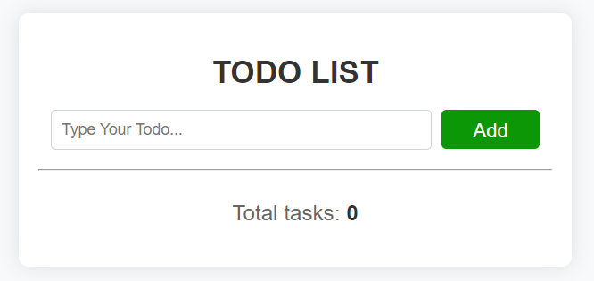
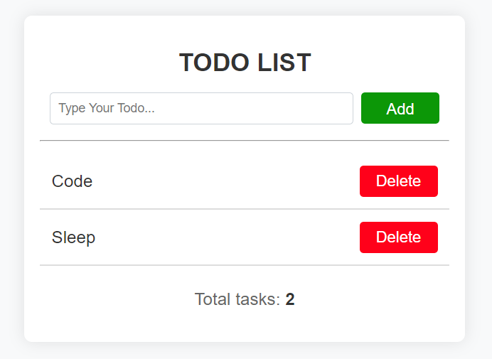

### Todo List App
 

This is a simple Todo List application built using HTML, CSS, and JavaScript. It allows users to add and delete tasks from their todo list.

<b>Features</b>
Add Tasks: Users can add new tasks to their todo list by typing in the input field and clicking the "Add" button.
Delete Tasks: Each task in the list has a "Delete" button that allows users to remove the task from the list.
Error Handling: If a user tries to add an empty task, an error message is displayed.
Responsive Design: The app is designed to be responsive and works well on both desktop and mobile devices.

 <b>Usage</b>
Clone the repository: git clone https://github.com/your_username/todo-list.git
Open index.html in your web browser.

 <b>Screenshots</b>
Empty Todo List

Todo List with Items

<b>Contributing</b>
Contributions are welcome! If you'd like to contribute to this project, please fork the repository and submit a pull request.

 <b>License</b>
This project is licensed under the MIT License - see the LICENSE file for details.

